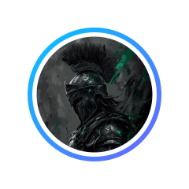
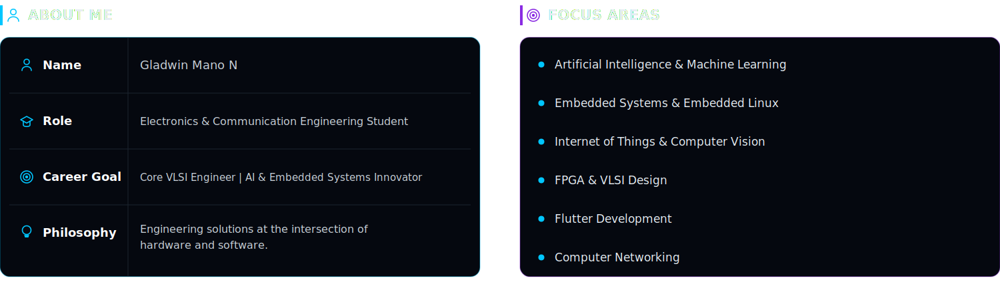
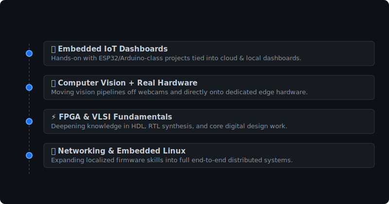

 
 
 

 

&nbsp;&nbsp;

&nbsp;&nbsp;

 

 

 

## 🛠️ Tech Stack

**💻 Languages & Core**

**🤖 AI / ML / Computer Vision**

**🎛️ Embedded / IoT / VLSI**

**⚙️ App Development & Tools**

 

## 🚀 Featured Projects

<table width="100%">
<tr>
<td width="50%" valign="top">

### [📂 CamVis (SmartVision)](https://github.com/gx09812/CamVis)

Real-time computer vision using YOLOv8, MediaPipe, and OpenCV for object, hand, face, and eye tracking. Built for AI, robotics, automation, and IoT applications.

`Python` `YOLOv8` `OpenCV` `MediaPipe`

</td>
<td width="50%" valign="top">

### [📂 Drone Project (Hackathon)](https://github.com/gx09812/dron_project_hackthon)

A hackathon project exploring drone systems where hardware, embedded programming, and rapid software development come together under tight deadlines.

`Hardware` `Embedded` `Hackathon`

</td>
</tr>
<tr>
<td width="50%" valign="top">

### [📂 Wireless MIMO Simulation](https://github.com/gx09812/wireless-mimo-simulation)

A Python-based simulation of a three-tower MIMO wireless network, visualizing signal strength, multipath fading, and cellular coverage.

`Python` `Simulation` `Networking`

</td>
<td width="50%" valign="top">

### [📂 Mukesh Art Gallery E-commerce](https://github.com/gx09812/mukesh-art-gallery-ecommerce)

An e-commerce gallery website built for a local community to showcase artwork and support custom art orders.

`JavaScript` `Web Development`

</td>
</tr>
<tr>
<td width="100%" colspan="2" valign="top">

### [📂 Mini Car](https://github.com/gx09812/mini_car)

A hands-on embedded systems project focused on building and controlling a small vehicle prototype using high-power lithium cells and motor controllers.

`Embedded Systems` `Hardware`

</td>
</tr>
</table>

 

## 🎯 Current Learning

 

## 📊 GitHub Stats

  

 

## 🐍 Contribution Snake

 

## 📈 What's Next

 

> *"Great engineers don't just write code or design circuits — they build the bridge between silicon and intelligence."*

 

## Let's Connect

  

